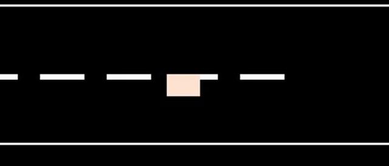

# Bruce-js-race
Thats a game intended for M5StickC plus 2 with bruce firmware. It is a primitive game that involves dodging oncoming cars
<p align="center">
  
</p>

## Features
- Horisontal gameplay gives gamer more visibility
- Intuitive controls

## Installation

```bash
git clone https://github.com/QwaBar4/Bruce-js-race.git
cd Bruce-js-race
```
After successful download launch Files -> WebUI and move game into your folder in LittleFS

## Usage

To launch a game you should:
- Go to JS Interpreter and launch race.js
### Or
- Go to Files -> LittleFS -> race.js -> JS Script Run

### Contributing
If you want to contribute with me, text me on telegram: @QwaBar4
